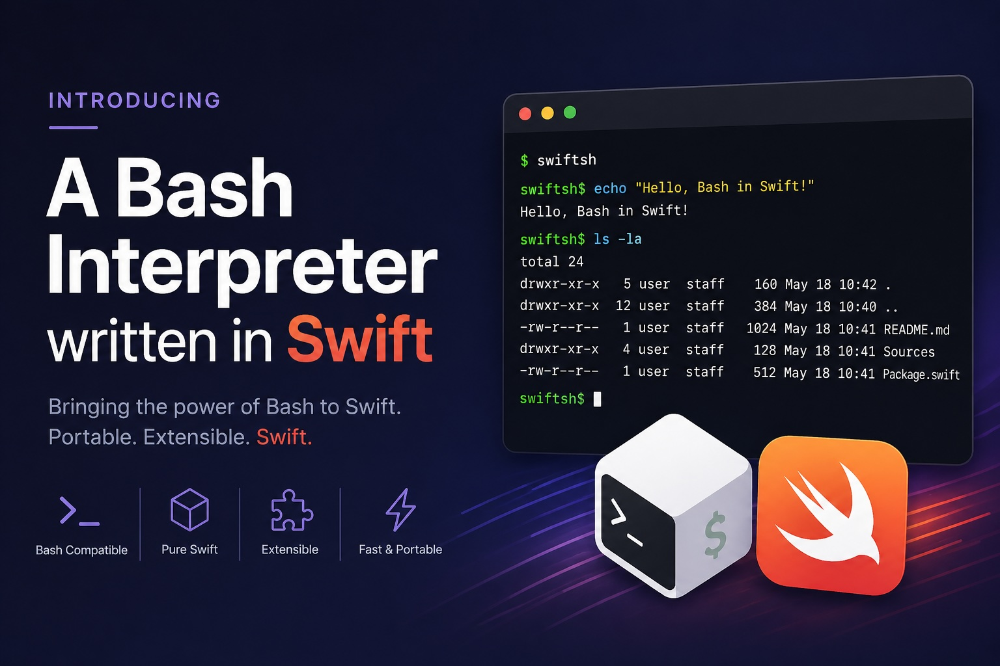

<p align="center">
  
</p>

# SwiftBash

A pure-Swift, sandboxed bash interpreter that drops into any Mac or
iOS binary. No `Process`, no `fork`, no `exec` — every command is a
registered Swift type, every byte streams through async channels, and
every host-touching axis (filesystem, network, processes, identity)
is virtualised by default.

**The goal:** be the local code interpreter for an LLM agent. Hand
the agent a workspace folder, hand it the network endpoints it's
allowed to call, and let it write and run bash scripts that
manipulate files, parse data, and fetch documents — all without ever
touching anything outside its sandbox. Same shell runs equally well
on a server, a Mac CLI tool, an iOS App Sandbox extension, or a
Swift Playground.

```swift
import BashInterpreter
import BashCommandKit

let shell = Shell()                    // sandbox-by-default identity
shell.registerStandardCommands()       // ls, cat, grep, sed, find, …

try await shell.run("""
    for f in *.txt; do
      echo "$(basename "$f" .txt): $(wc -l < "$f") lines"
    done | sort -k2 -n
    """)
```

## Products

| Product             | Status     | What it does                                                                |
|---------------------|------------|-----------------------------------------------------------------------------|
| **`BashSyntax`**       | Available  | Parse bash into a typed AST. Smart tokeniser for shell-aware splitting.    |
| **`BashInterpreter`**  | Available  | Execute the AST in-process. Streaming pipelines, full bash 4.x semantics.  |
| **`BashCommandKit`**   | Available  | Catalog of `ls`/`cat`/`grep`/`sed`/`find`/`curl`/… built on Swift Argument Parser. |
| **`SwiftJSCore`**      | Available (Apple); engine linked on Linux + Android, runtime port pending | Node-style JavaScript runtime on JavaScriptCore. `require`, ESM `import`, `node:fs/path/os/crypto/zlib/child_process/…`, `fetch`, `Buffer`, timers, `AbortController`, `WebAssembly`. |
| **`BashSwiftScript`**  | Available  | `#!/usr/bin/env swift-script` shebang dispatch via Cocoanetics' [SwiftScript](https://github.com/Cocoanetics/SwiftScript) tree-walking interpreter. IO / sandbox / identity flow through ShellKit, so a script honors the bash sandbox the same way `gh`/`jq`/etc. do. |
| **`swift-bash`** (CLI) | Available  | `exec` and `parse` subcommands; sandbox flags for confined execution. Auto-registers SwiftScript so `./hello.swift` runs in-process. |
| **`swift-js`** (CLI)   | Available (Apple); Linux + Android pending runtime port | Drop-in for `node` — `swift-js install` symlinks `node`/`bun` so existing `#!/usr/bin/env node` scripts run unchanged. |

## Component docs

- **[BashSyntax](Docs/BashSyntax.md)** — AST model, parser, tokeniser,
  visitor protocol.
- **[BashInterpreter](Docs/BashInterpreter.md)** — execution model,
  streams, custom commands, built-ins, bash 4.x semantics.
- **[BashCommandKit](Docs/BashCommandKit.md)** — every shipped
  `ls`/`cat`/`grep`-style command + how to add your own typed ones.
- **[SwiftJS](Docs/SwiftJS.md)** — Node-style JavaScript runtime on
  JavaScriptCore. Embeddable + `swift-js` CLI shadow for `node`/`bun`.
  Apple platforms use the system `JavaScriptCore.framework`; Linux
  and Android link the engine from
  [Bun's prebuilt JSC archive](Docs/SwiftJS.md#cross-platform-jsc-everywhere-via-buns-prebuilt-archive)
  via the `CJavaScriptCore` C-API target. End-to-end smoke
  (`JSGlobalContextCreate` → `JSEvaluateScript("1 + 2")` → `3.0`) is
  verified in CI on macOS, iOS, Linux, and Android.
- **[SwiftScript](Docs/SwiftScript.md)** — `#!/usr/bin/env swift-script`
  shebang dispatch routing through SwiftScript's tree-walking
  interpreter. Wires output / stdin / sandbox / network / identity
  through the bash shell's ShellKit context.
- **[Sandboxing](Docs/Sandboxing.md)** — the four virtualisation axes
  (filesystem, network, processes, identity) and the `--sandbox` flag.
- **[Networking](Docs/Networking.md)** — `curl`, the URL allow-list,
  SSRF defenses.
- **[Virtual /bin and /usr/bin](Docs/VirtualBin.md)** — how `ls /bin`
  reflects the live command registry instead of the host's binaries.
- **[CLI](Docs/CLI.md)** — `swift-bash parse` and `swift-bash exec`,
  with examples.
- **[Bash version conformance](Docs/BashVersionConformance.md)** — every
  feature where SwiftBash diverges from macOS-shipped `/bin/bash 3.2`.

## Why pure Swift?

Because the runtime targets are places where you can't `fork`:

- **iOS apps** — any process spawn is blocked by App Sandbox.
- **macOS App Sandbox** — same constraint.
- **Swift Playgrounds** — pure interpreter only.
- **Server-side Swift** — embedding a shell shouldn't require pulling
  in a separate `bash` binary or worrying about `$PATH` differences.

Every command is a `Command` Swift type; pipelines are
`AsyncStream<Data>` channels; the FS is a `FileSystem` protocol you
swap implementations of. Nothing leaves the process unless an embedder
explicitly says "yes, run this network request" or "yes, surface my
real username."

## Sandbox-by-default in 30 seconds

A freshly-constructed `Shell()` already leaks nothing about the host:

```bash
$ echo 'whoami; hostname; ls /Users; cat /etc/passwd' \
    | swift-bash exec --sandbox /tmp/work /dev/stdin
user
sandbox
ls: /Users: No such file or directory
cat: /etc/passwd: No such file or directory
```

To opt in:

```swift
shell.hostInfo = .real()                                // real whoami
shell.networkConfig = NetworkConfig(                    // allow API calls
    allowedURLPrefixes: ["https://api.example.com/"])
shell.fileSystem = RealFileSystem()                     // real disk
```

Each axis is independent. Read [Sandboxing](Docs/Sandboxing.md) for
the threat model and the complete picture.

## Install

```swift
.package(url: "https://github.com/.../SwiftBash", from: "0.1.0")
```

then depend on the products you want:

```swift
.target(name: "YourTarget", dependencies: [
    .product(name: "BashInterpreter", package: "SwiftBash"),
    .product(name: "BashCommandKit",  package: "SwiftBash"),
    // .product(name: "BashSyntax", package: "SwiftBash"),   // AST only
]),
```

## License

MIT. See [LICENSE](LICENSE).
